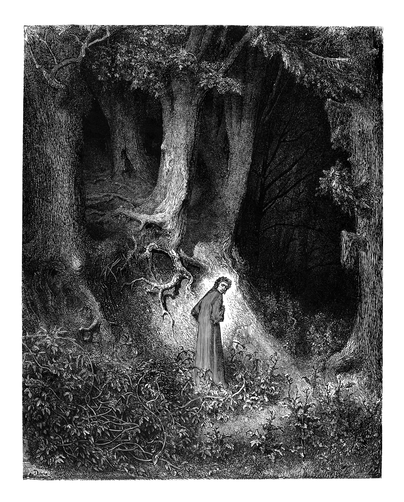

# Doré Vision
Gustave Doré Divine Comedy illustrations with accompanying excerpts from the original work (Italian) and the H. F. Cary translation (English). A script for automated generation of the anthology is provided.

For automated generation, the repository should at minimum initially contain the following files in the structure shown below:

```text
dore_vision/
├── document/
│   ├── illustrations/
│   │   └── book_folder/
│   │   │   └── image_file.jpg
│   │   │   └── ...
│   │   └── ...
│   └── References.bib
├── Dore_vision_starter.tex
├── Dore_vision_text.csv
├── generator.py
└── requirements.txt
```

installation:

```bash
pip install -r requirements.txt
```

usage:

```bash
python generator.py
```

